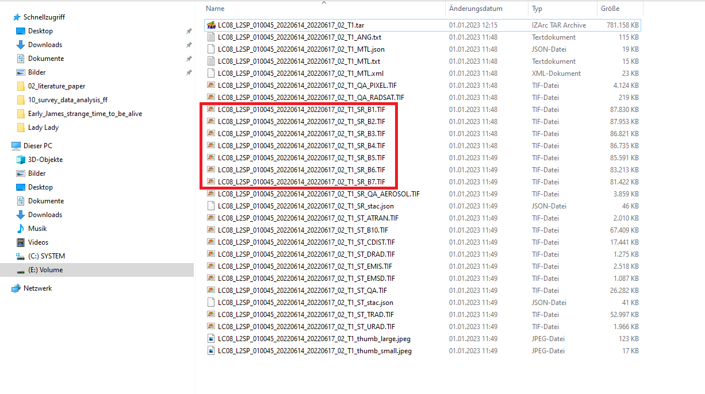

## Remote Sensing Tutorial 1 - Download of Landsat and Sentinel satellite images

**Abstract** 
In this Tutorial we will learn how to download multispectral satellite images of Landsat and Sentinel-2 sensors. We will also learn how to pre-process the satellite images in order to load them in QGIS or Python. For pre-processing of Sentinel-2 images we will make use of the European Space Agency's BEAM software which you can download here:

[Download SNAP software](https://step.esa.int/main/download/snap-download/)

## Download Landsat data from the EarthExplorer portal of the USGS

For downloading Landsat imager, several web-portals exist. However, from my experience, the by far most comfortable option is the earthexplorer webpage of USGS: https://earthexplorer.usgs.gov/. A very good video-tutorial on how to download Landsat satellite imagery is provided here:

[Download Landsat images from the USGS earth explorer website](https://www.youtube.com/watch?v=Wn_G4fvitV8)

Please have a look at the video and download a Landsat 8 or Landsat 9 image from the year 2022 from any location of the world, that you are interested in. Make sure that you download an image of **Collection 2 Level 2**.  One small tip: It will be easier to find a suitable (cloud-free) image if you focus on a region of the Earth that is not permanently clouded (tropical areas are often tricky).

When following the instructions in the video, please additionally consider the following remarks:

1. Contrarily to what is said in the video, I would recommend to always download the packaged file (and not the individual bands) if you have a decent internet connection - this will be less complicated and you will make sure that you indeed downloaded all files that you need.
2. Be aware that depending on the time period you indicate at the beginning of the process, images from some Landsat sensors may not be available since the Landsat sensors all operated for a certain time period as indicated in Table 1. That is, if you want an image from 2022, you will only be able to download images from Landsat 7,8 and 9 since the other sensors were not operating anymore in 2022.
3. When working with the downloaded data, it is extremely important to understand the processing level of the data which depends on selected Level and Collection. You can find more information on this here: https://www.usgs.gov/landsat-missions/product-information
Having a closer look at those details is very valuable as it will enable you to fully understand what the downloaded files contain (e.g., the physical unit and the scaling in which the information in the bands is stored, etc.). We will get back to this later on.

**Table 1: Landsat sensors operation time**
|Sensor|Operation time  |
|--|--|
| Landsat 1 | 1972-1978 |		
| Landsat 2 | 1975-1982 |	
| Landsat 3 | 1978-1983 |	
| Landsat 4 | 1982-1993 |	
| Landsat 5 | 1984-2013 (!!) |	
| Landsat 7 | 1999-today |	
| Landsat 8 | 2013-today |	
| Landsat 9 | 2021-today |	

## Download Sentinel-2 data from ESA's open science hub

Similarly as in the case of Landsat, there is also a comparably comfortable (even though slightly less comfortable than the earthexplorer page - at least in my opinion) webpage to download Sentinel-2, as well as Sentinel-1 and 3 images. You can find the webpage here: https://scihub.copernicus.eu/

Once again, there is a very good video available with instructions on how to download Sentinel-2 images from the webpage:
[Download Sentinel-2 images from the ESA science hub website](https://www.youtube.com/watch?v=AkA0ya3A9lU) 

Please have a look at the video and download a Sentinel-2 image from the approximately same time period and location as you chose for the Landsat image. Be aware that Sentinel-2 images are only available starting from mid-2015.

Once we have downloaded the images, we will continue with some simple pre-processing steps to save both images as multi-layer geotiff-files which we can then use in Python or QGIS. We will need different pre-processing work-flows for Landsat and Sentinel-2 and while there are also options available to perform the pre-processing steps directly in Python, we will here first learn the basic option using SNAP for the Sentinel-2 image and QGIS for the Landsat image.

## Pre-process the Landsat image into a multi-layer geotiff file using QGIS

After downloading the Landsat 8 or 9 image from the earthexplorer webpage and extracting the archive file you should have a file folder similar to the one shown in Figure 1.

**Figure 1: Files of a Landsat-image after extraction**

The folder includes numerous meta-data files as well as the actual remote sensing data. The most important files are the images containing the spectral values observed by each of the channels of the satellite sensor. These images can be identified by their ending:

**..._SR_B*.TIF**

where the * takes values between 1 and 7 for the bands 1 to 7 of Landsat 8 (in my case). That is, B stands for "Band" while SR stands for "surface reflectance". This is the case because I downloaded level 2 data which have already been atmospherically corrected. We will learn more about this in one of the next lectures.

Additionally, a band with ending

..._ST_B10.TIF

is available which represents the thermal band of Landsat with ST standing for "surface temperature".

The exact physical units and scaling of the data contained in the images can be checked in the official product descriptions of the Landsat sensors. For the image I have downloaded, the corresponding information can be found in the report provided here:

https://www.usgs.gov/media/files/landsat-8-9-collection-2-level-2-science-product-guide

It is highly recommended to have a closer look at these reports and you will have to do this to answer some of the questions asked below.

For now, we will focus on the spectral bands containing surface reflectance information (bands are marked in Figure 1. ). We will now use QGIS to stack these bands and save them into a single geotiff file.

To do this we open the Toolbox in QGIS (if not already open) by selecting:

"Processing" (in the main file menu) ⇒ "Toolbox"

Then we search for the keyword "merge" in the toolbox window as shown in Figure 2.

**Figure 2: Find the GDAL-merge tool**

In the list of returned tools, we select the "merge" tool listed under GDAL ⇒ Raster miscellaneous and double click-it to open it (tool is selected in Figure 02).

**Figure 3: The GDAL-merge tool**

In the upcoming dialogue shown in Figure 3, we will then have to add the 7 Landsat channels containing the spectral values observed by the satellite sensor. For this we press the "..." - button next to the "input Layers" section. 

**Figure 4: Adding bands to the merge tool**

The menu will change to a new window as shown in Figure 4. Here, we will now press the "Add File(s)" button (marked with 1 in Figure 4) and select the 7 spectral bands with the endings _SR_B*.TIF as marked in Figure 1 and confirm with "open". Make sure that the order is also correct with B1 being the first/top band and B7 the last/bottom. If everything is correct, use the "arrow button" marked with 2 in Figure 4 to return to the main menu of the "merge" tool.

**Figure 5: Applying  the merge tool**

As last step we select the option "Place each input file into a separate band" and define an output filename and path (as marked with 1 and 2 in Figure 5). Then we click "run" to merge the 7 bands into a single multi-layer/band geotif-file.

**Figure 6: The resulting merged multi-band image**

This should result in a view similar as in Figure 6 - even though the actual view might of course be very different depending on which image you downloaded. With some adjustment of the visualization settings with which you should already be familiar with from the GIS-parts of the course we can obtain a RGB-view of the satellite images, mimicking the visual impression we have as humans (Figure 7).

**Figure 7: The resulting merged multi-band image in RGB view**

You should now be able to pre-process and visualize Landsat images in QGIS. This is a really interesting skill, considering that Landsat images are available since 1972 and for the complete globe. The number of bands to merge and the visualization settings will differ depending on the Landsat sensor with which the data was collected, but you will always be able to understand which bands you have to add to your image stack if you refer to the Landsat product guides which you can find under the links above.

