
## Remote Sensing Tutorial 1 - Download of Landsat and Sentinel satellite images

**Abstract** 
In this Tutorial we will learn how to download multispectral satellite images of Landsat and Sentinel-2 sensors. We will also learn how to pre-process the satellite images in order to load them in QGIS or Python. For pre-processing Sentinel-2 images we will use the European Space Agency's BEAM software which you can download here:

[Download SNAP software](https://step.esa.int/main/download/snap-download/)

## Download Landsat data from the EarthExplorer portal of the USGS

For downloading Landsat images, several web-portals exist. However, from my experience, the by far most comfortable option is the earthexplorer webpage of USGS: https://earthexplorer.usgs.gov/. A very good video-tutorial on how to download Landsat satellite imagery is provided here:

[Download Landsat images from the USGS earth explorer website](https://www.youtube.com/watch?v=Wn_G4fvitV8)

Please have a look at the video and download a Landsat 8 or Landsat 9 image from the year 2022 from any location of the world, that you are interested in. Make sure that you download an image of **Collection 2 Level 2**.  One small tip: It will be easier to find a suitable (cloud-free) image if you focus on a region of the Earth that is not permanently clouded (tropical areas are often tricky).

When following the instructions in the video, please additionally consider the following remarks:

1. Contrarily to what is said in the video, I would recommend to always download the packaged file (and not the individual bands) if you have a decent internet connection - this will be less complicated and you will make sure that you indeed download all files that you need.
2. Be aware that depending on the time period you indicate at the beginning of the process, images from some Landsat sensors may not be available since the Landsat sensors all operated for a certain time period as indicated in Table 1. That is, if you want to download an image from 2022, you will only be able to download images from Landsat 7,8 and 9 since the other sensors were not operating anymore in 2022.
3. When working with the downloaded data, it is extremely important to understand the processing level of the data which depends on selected Level and Collection. You can find more information on this here: https://www.usgs.gov/landsat-missions/product-information
Having a closer look at those details is very valuable as it will enable you to fully understand what the downloaded files contain (e.g., the physical unit and the scaling in which the information in the bands is stored, etc.). We will get back to this later on.

**Table 1: Landsat sensors operation time**
|Sensor|Operation time  |
|--|--|
| Landsat 1 | 1972-1978 |		
| Landsat 2 | 1975-1982 |	
| Landsat 3 | 1978-1983 |	
| Landsat 4 | 1982-1993 |	
| Landsat 5 | 1984-2013 (!!) |	
| Landsat 7 | 1999-today |	
| Landsat 8 | 2013-today |	
| Landsat 9 | 2021-today |	

## Download Sentinel-2 data from ESA's open science hub

Similarly as in the case of Landsat, there is also a comparably comfortable (even though slightly less comfortable than the earthexplorer page - at least in my opinion) webpage to download Sentinel-2, as well as Sentinel-1 and 3 images. You can find the webpage here: https://dataspace.copernicus.eu/

Once again, there is a very good video available with instructions on how to download Sentinel-2 images from the webpage:
[Download Sentinel-2 images from the ESA Copernicus dataspace](https://www.youtube.com/watch?v=g_kr3vNJiTE) 

Please have a look at the video and download a Sentinel-2 image from the approximately same time period and location as you chose for the Landsat image. Be aware that Sentinel-2 images are only available starting from mid-2015. 

Make sure that you save the Landsat and Sentinel-2 files at a location on your computer that you are able to find again afterwards.

Once we have downloaded the images, we will continue with some simple pre-processing steps to save both images as multi-layer geotiff-files which we can then use in Python or QGIS (as already learned in the GIS-practicals of the course). We will apply different pre-processing work-flows for Landsat and Sentinel-2 and while there are also options available to perform the pre-processing steps directly in Python, we will here first learn the basic option using SNAP for the Sentinel-2 image and QGIS for the Landsat image.

## Pre-process the Landsat image into a multi-layer geotiff file using QGIS

After downloading the Landsat 8 or 9 image from the earthexplorer webpage and extracting the archive file on your hard-disc you should have a file folder similar to the one shown in Figure 1. Extracting an archive file typically works by performing a right-click on the downloaded file and then select some option related to "extract files" - in case you cannot open the downloaded files, you might have to install a (de-)compression software tool first - you can for example use "7zip" (=> simply google, download and install it). 

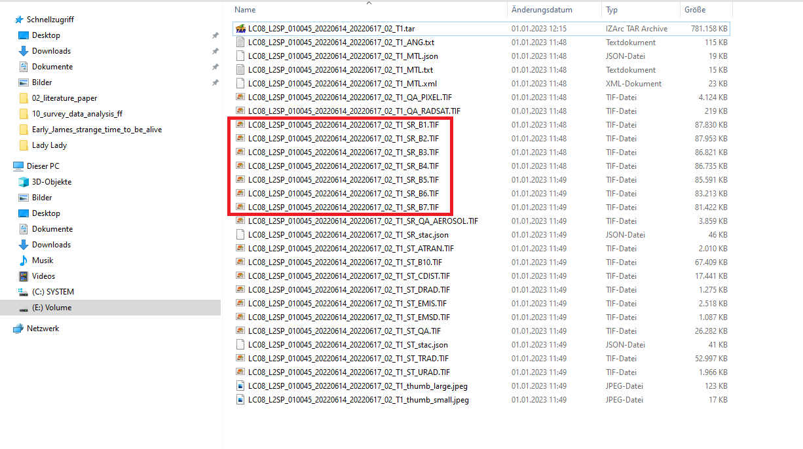

**Figure 1: Files of a Landsat-image after extraction**

The extracted files include numerous meta-data files as well as the actual remote sensing data. The most important files are the image files containing the spectral values observed by the spectral channels of the satellite sensor. These images can be identified by their ending:

**..._SR_B*.TIF**

where the * takes values between 1 and 7 for the bands 1 to 7 of Landsat 8 (in my case). That is, B stands for "Band" while SR stands for "surface reflectance". This is the case because I downloaded level 2 data which have already been atmospherically corrected, that is the radiance measured at the sensor has been converted to surface reflectance. We will learn more about this in one of the next lectures.

Additionally, a band with ending

..._ST_B10.TIF

is available which represents the thermal band of Landsat with ST standing for "surface temperature".

The exact physical units and scaling of the data contained in the images can be checked in the official product descriptions of the Landsat sensors. For the image I have downloaded, the corresponding information can be found in the report provided here:

https://www.usgs.gov/media/files/landsat-8-9-collection-2-level-2-science-product-guide

It is highly recommended to have a closer look at these reports and you will have to do this to answer some of the questions asked below.

For now, we will focus on the spectral bands containing surface reflectance information (bands are marked in red in Figure 1. ). We will now use QGIS to stack these bands and save them into a single multi-layer/band geotiff file.

To do this we open the Toolbox in QGIS (if not already open) by selecting:

"Processing" (in the main file menu) ⇒ "Toolbox"

Then we search for the keyword "merge" in the toolbox window as shown in Figure 2.

**Figure 2: Find the GDAL-merge tool**

In the list of returned tools, we select the "merge" tool listed under **GDAL ⇒ Raster miscellaneous** and double click-it to open it (tool is selected in Figure 02).

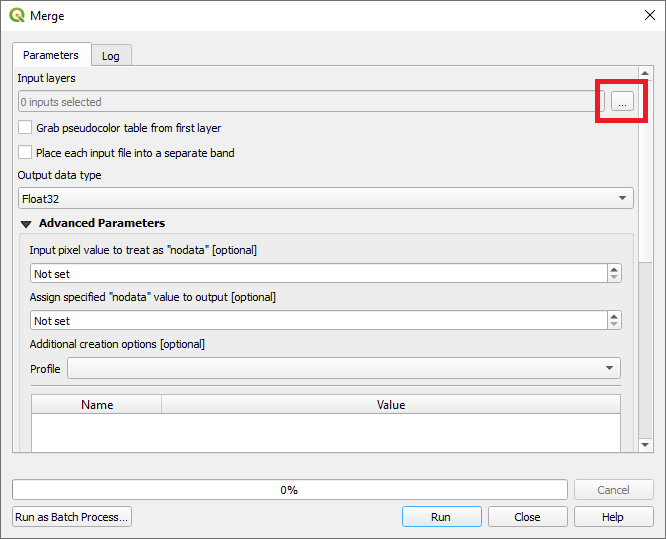

**Figure 3: The GDAL-merge tool**

In the upcoming dialogue shown in Figure 3, we will then have to add the 7 Landsat channels containing the spectral values observed by the satellite sensor. For this we press the **"..."** - button next to the **"input Layers"** section. 

**Figure 4: Adding bands to the merge tool**

The menu will change to a new window as shown in Figure 4. Here, we will now press the **"Add File(s)" button** (marked with 1 in Figure 4) and select the 7 spectral bands with the endings _SR_B*.TIF as marked in Figure 1 and confirm with "open". Make sure that the order is also correct with B1 being the first/top band and B7 the last/bottom. If everything is correct, use the "arrow button" marked with 2 in Figure 4 to return to the main menu of the "merge" tool.

**Figure 5: Applying  the merge tool**

As last step we select the option **"Place each input file into a separate band"** and define an **output filename and path** (as marked with 1 and 2 in Figure 5). Then we click **"run"** to merge the 7 bands into a single multi-layer/band geotif-file.

**Figure 6: The resulting merged multi-band image**

This should result in a view similar as in Figure 6 - even though the actual view might of course be very different depending on which image you downloaded. With some adjustment of the visualization settings with which you should already be familiar with from the GIS-parts of the course we can obtain a RGB-view of the satellite images, mimicking the visual impression we have as humans (Figure 7).

**Figure 7: The resulting merged multi-band image in RGB view**

You should now be able to pre-process and visualize Landsat images in QGIS. This is a really interesting skill, considering that Landsat images are available since 1972 and for the complete globe. The number of bands to merge and the visualization settings will differ depending on the Landsat sensor with which the data was collected, but you will always be able to understand which bands you have to add to your image stack if you refer to the Landsat product guides which you can find under the links above.

## Pre-process the Sentinel-2 image into a multi-layer geotiff file using SNAP

After downloading the Sentinel-2 image and extracting the archive file on your hard-disc you should have a file folder similar to the one shown in Figure 8. 

**Figure 8: Files of a Sentinel-2 image after extraction**

In case of Sentinel-2, the situation is even more complex than with Landsat and not only numerous files are visible but there are even several sub-folders containing meta-data as well as the original image files. As already shown in the download-video, the actual image files of the Sentinel-2 image can be found in of the subfolders which in my case is named:

"GRANULE\L1C_T18QXJ_A027836_20220705T153624\IMG_DATA"

The bands are saved in jpeg2000 format which is a compressed format which, however, does not lose any information.

The jpeg2000-format is a not that common format and hence, it might be desirable to save the data in a different format such as geotif which can be opened by most software for processing geodata. Besides the data format we have to consider as well that not all bands of Sentinel-2 have the same spatial resolution. There are four bands at 10 m spatial resolution (pixel size) and 6 bands at 20 m spatial resolution. Furthermore, there are two bands with 60 m spatial resolution. The latter are mostly used to inform atmospheric correction algorithms.

The typical procedure to pre-process Sentinel-2 images hence includes to build a **subset** of only the bands with 10 and 20 m spatial resolution, **stack** them, **resample** some of the bands and save all bands into a multi-layer/band file with either 10 or 20 m pixel size.

The probably easiest way to accomplish these pre-processing steps is to use the SNAP toolbox of the European Space Agency. SNAP is a quite complete free and open-access toolbox which offers numerous tools to visualize and analyse remote sensing data. In the following, we will not explore all options that are available in SNAP, but if you are interested in getting to know the software a bit better, there are numerous resources on the web, including the tutorials on the official webpage:

https://step.esa.int/main/doc/tutorials/

As well as some inofficial youtube-videos such as:

https://www.youtube.com/watch?v=IqqH4UEVGmY

Here, we will only get to know the steps necessary to load the S2-image into SNAP and save the image into a multi-layer/band geotif file.

For this we first open SNAP. In the main menu of SNAP we select 

**File ⇒ Import ⇒ Optical Sensors ⇒ Sentinel-2 ⇒ S2-MSI L1C**

as shown in Figure 9.

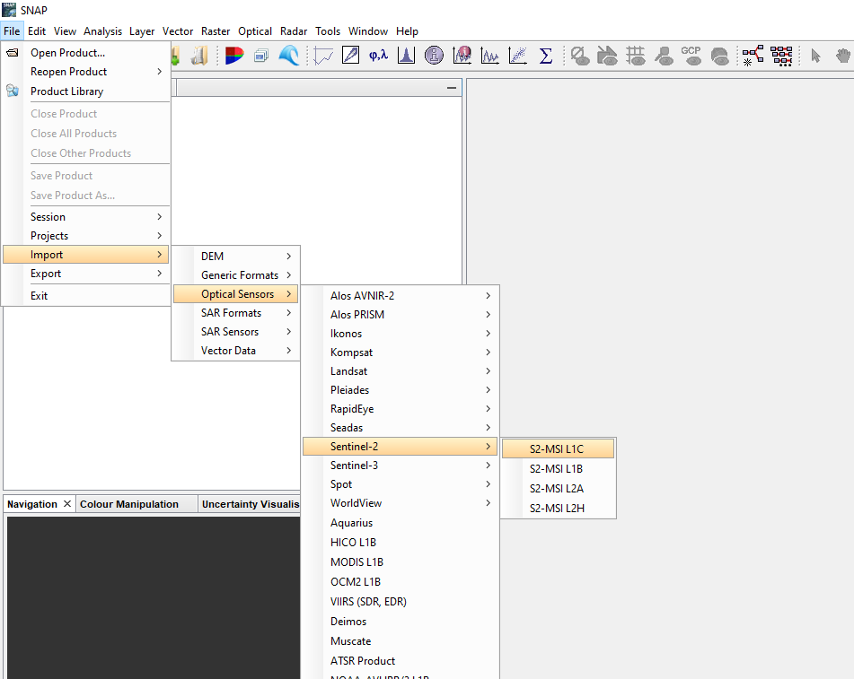

**Figure 9: Files of a Sentinel-2 image after extraction**

In the upcoming dialogue, we now browse to the folder which contains our extracted and downloaded Sentinel-2 dataset. Here, we then select the .xml file **which IS NOT CALLED "Inspire.XML"**. The name of the file is always different and depends on the downloaded image. In my case the file we have to open is called **"MTD_MSIL1C.xml"**.

We select the file and confirm with **"Import Product"** (see Figure 10).

**Figure 10: Files of a Sentinel-2 image after extraction**

After a few seconds the Sentinel-2 image will appear in the Product-Explorer window on the left in the SNAP user interface. We can expand the menus (by clicking the buttons marked in red in Figure 11) to get a better idea of what the file contains.

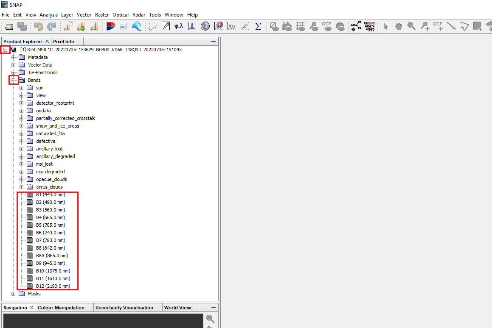

**Figure 11: Exploring the Sentinel-2 image in SNAP**

We can see that the file is rather complex with numerous sub-folders containing more folders. The actual image-data we are mostly interested in is contained in the "Bands" folder as also marked in Figure 11.

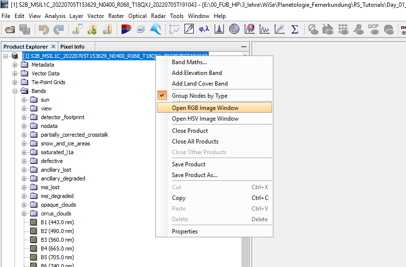

**Figure 12: Open RGB view**

If we want to have a look at what the image looks like, we can perform a right click on the product name and select 

"Open RGB Image Window" as shown in Figure 12.

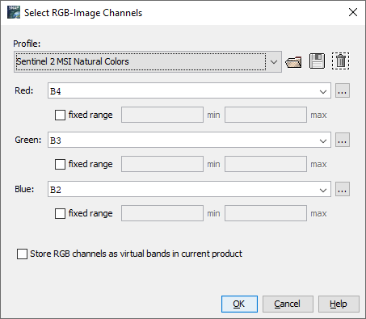

**Figure 13: Open RGB view**

In the new dialogue, we simple confirm with "OK" (Figure 13). And then a RGB-view of your satellite image should appear. In my case this looks like shown in Figure 14.

**Figure 14: RGB view of the Sentinel-2 image**

We will not dive further into the various visualization options SNAP offers but directly continue with the pre-processing steps.

For this we select 

**Raster  ⇒ Subset**

as shown in Figure 15.

**Figure 15: Subset Sentinel-2 image**

From the main file menu. In the appearing dialogue, we select the "band subset" section as marked in Figure 16. Here, we now select only the Sentinel-2 bands that either have a spatial resolution of 10 or 20 m. Formulated in other words, we will drop the bands 1, 9 and 10 which all have a spatial resolution of 60 m. Please be aware that you have to know which Sentinel-2 bands have which spatial resolution. You can also check this in the meta-data but it is somehow expected that you familiarized yourself with the sensor of the data you are working with.

Technical details of the Sentinel-2 sensors can be found for example here:

https://sentinel.esa.int/web/sentinel/user-guides/sentinel-2-msi

**Figure 16: Selecting only bands with 10 or 20 m spatial resolution**

We then confirm with "OK" and a new version of my image will immediately appear in the Product Explorer window. Be aware that so far SNAP is not saving this subset as a new image. It only defined the subset on the "meta-data" level. The actual processing and subsetting of the bands will only take place, once the image is saved to a new file. 

Before we can actually save the image to a geotif-file, we will have to conduct one additional pre-processing step. We have to resample either the 10 m bands to 20 m or the 20 m bands to 10 m to have the same spatial resolution for each raster layer.

To do this we select

**Raster ⇒ Geometric ⇒ Resampling**

as shown in Figure 17.

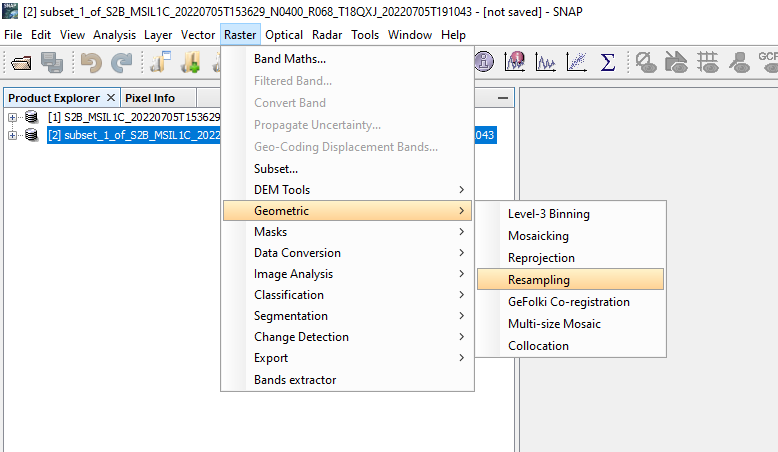
**Figure 17: Opening the resampling tool in SNAP**

In the appearing window, we select the **"Resampling Parameters"** section and chose the option **"By reference band from source product"** - here we can now either select a band with 10 m spatial resolution or 20 m spatial resolution and all other bands will be resampled to this resolution (if necessary). In my case, I select a band with 10 m spatial resolution (Band 2).

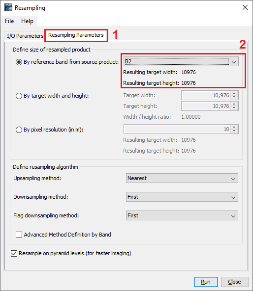
**Figure 18: The resampling tool in SNAP**

The resampling method is set to "Nearest" to not induce any changes to the measured values.

We confirm by pressing **"Run"**.

After pressing "Run", immediately a new image product will appear in the Product Explorer window. We will select this new product as shown in Figure 19 and then, as final step, export this image product to a geotif-file.

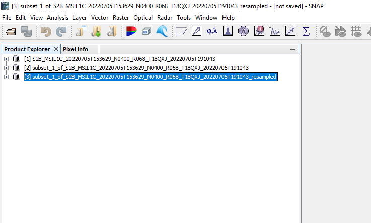
**Figure 19: Select the subsetted and resampled image to export it in a geotif file **

For this we select the option

**File ⇒ > Export ⇒ GeoTIFF / Big TIFF**

as shown in Figure 20.

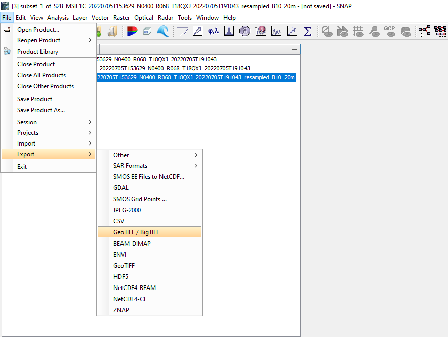
**Figure 20: Select the subsetted and resampled image to export it in a geotif file **

In the appearing dialogue, we enter a filename and press "Export product" (as shown in Figure 21). Now the actual processing of the image starts. Hence, this whole procedure may take a while since all of the steps defined above, that is, subsetting the image, reampling the image and saving the image to a Tiff-file will now all be performed one after the other.

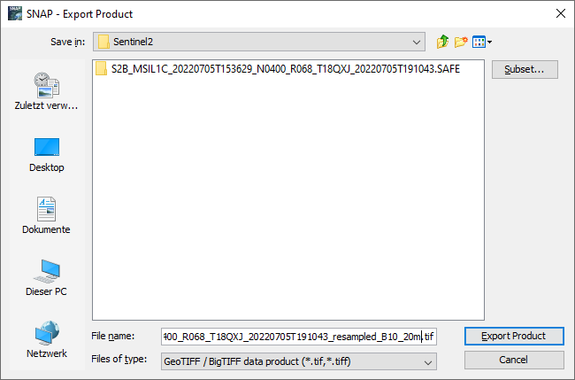
**Figure 21: Export the Sentinel-2 image to a geotif file **

If you want to make sure that everything has worked fine, you can load the exported Geotif-file in QGIS and visualize it as a RGB image as you have learned in during earlier lectures of the course. 

## Exercises for RS tutorial 1

1. Identify the physical unit and scaling of the Landsat and Sentinel-2 image you have downloaded.  That is, you have to report 

- whether the spectral information is for example saved as "digital numbers" / "radiance" / "top of atmosphere reflectance" / "surface reflectance" etc. 
- What the numbers of the raster cells mean - they could for example be reflectance values scaled between 0 and 10000 where 10000 = 100% reflectance, or they could be raw digital numbers between 0 and 255.

To answer this question, you will most likely have to read the product guides of the Sentinel-2 and Landsat products you have downloaded

2.  To prove that you have completed the tutorial, please provide two Screenshots showing the Landsat and Sentinel-2 image in a color-composite (either RGB or CIR) in QGIS. RGB would be the impression we have with our eyes (Red => Red, Green => Green, Blue => Blue) and in the CIR mode the channels are assigned as follows: Red => Near Infrared, Green => Red, Blue => Green.
